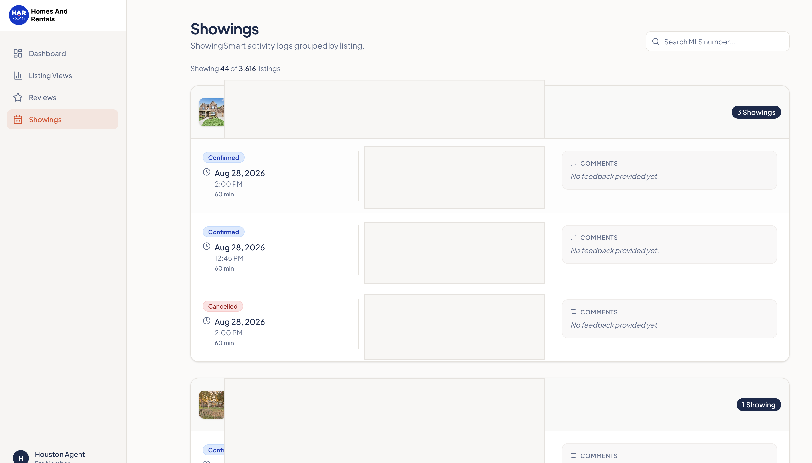

# HAR Member Dashboard

A web dashboard for Houston Association of REALTORS (HAR) members to monitor their HAR.com activity through the Repliers API.

The dashboard brings together:

- Listing web and mobile view analytics
- Client transaction reviews and component scores
- ShowingSmart showing activity and feedback
- An overview of traffic, review, and showing totals
- Search and load-more pagination for large result sets

The application is a proxy-based dashboard: the browser talks to the local API server, and the API server securely forwards requests to Repliers. The Repliers API key is never sent to the browser.



_Example dashboard view with property and agent information redacted._

## Tech stack

- React 19
- Vite
- Tailwind CSS v4
- shadcn/ui and Radix UI
- Express 5
- TypeScript
- pnpm workspaces
- TanStack React Query
- Orval-generated API hooks and Zod schemas

There is no application database. Data is loaded from the Repliers API when the dashboard requests it.

## Prerequisites

- Node.js 24
- pnpm
- A Repliers API key with access to the HAR partner endpoints

If pnpm is not installed, enable it through Corepack:

```bash
corepack enable
corepack prepare pnpm@latest --activate
```

## Getting started

### 1. Clone and install

```bash
git clone <repository-url>
cd <repository-directory>
pnpm install
```

### 2. Configure the Repliers API key

Set `REPLIERS_API_KEY` in the environment where the API server runs.

For local development, you can export it in the terminal before starting the server:

```bash
export REPLIERS_API_KEY="your-repliers-api-key"
```

Do not commit the key to the repository or place it in frontend code. Use your development environment's secret or environment-variable management to provide it securely.

### 3. Start the API server

The API server requires a `PORT` value:

```bash
PORT=8080 pnpm --filter @workspace/api-server run dev
```

The server will be available at `http://localhost:8080`.

### 4. Start the dashboard

In a second terminal, start Vite:

```bash
PORT=5173 BASE_PATH=/ pnpm --filter @workspace/har-dashboard run dev
```

The dashboard will be available at `http://localhost:5173`.

> When the frontend and API run on separate local ports, configure your local reverse proxy or development setup so `/api/*` requests from the dashboard are forwarded to the API server at port 8080.

## Available commands

Run these from the repository root:

```bash
# Install dependencies
pnpm install

# Typecheck all libraries, artifacts, and scripts
pnpm run typecheck

# Typecheck and build all packages
pnpm run build

# Start only the API server
PORT=8080 pnpm --filter @workspace/api-server run dev

# Start only the dashboard
PORT=5173 BASE_PATH=/ pnpm --filter @workspace/har-dashboard run dev
```

The API server's `dev` command builds the server before starting it. The dashboard's `dev` command starts Vite in development mode.

## API routes

The Express server exposes these routes under `/api/har`:

| Route | Repliers endpoint | Purpose |
| --- | --- | --- |
| `GET /api/har/views` | `/partners/har/listings/views` | Listing web and mobile views |
| `GET /api/har/reviews` | `/partners/har/listings/reviews` | Transaction reviews and scores |
| `GET /api/har/showings` | `/partners/har/showingsmart/logs` | ShowingSmart logs grouped by listing |
| `GET /api/har/summary` | Aggregates the three endpoints | Dashboard headline statistics |

The views, reviews, and showings routes support the date filters and pagination parameters used by the dashboard, including `limit` and `offset`. Views and reviews also support MLS and board-agent filters where permitted by the upstream API.

Example request:

```bash
curl "http://localhost:8080/api/har/views?dateBegin=2026-07-01&dateEnd=2026-07-31&limit=50&offset=0"
```

The API server adds the `REPLIERS-API-KEY` header when it calls Repliers. Credentials should only be configured on the server.

## Project structure

```text
.
├── artifacts/
│   ├── api-server/       Express proxy server
│   └── har-dashboard/    React/Vite frontend
├── lib/
│   ├── api-client-react/ Generated React Query hooks
│   ├── api-spec/         OpenAPI source and code generation
│   └── api-zod/          Generated/request validation schemas
├── scripts/               Workspace utility scripts
├── package.json           Root workspace scripts
└── pnpm-workspace.yaml    Workspace and dependency configuration
```

Important files:

- `artifacts/api-server/src/routes/har.ts` — Repliers proxy routes and summary aggregation
- `artifacts/har-dashboard/src/pages/` — Dashboard, views, reviews, and showings pages
- `lib/api-spec/openapi.yaml` — API contract source of truth
- `lib/api-client-react/src/generated/` — Generated client hooks; do not edit manually

## Regenerating the API client

If you change the OpenAPI contract, regenerate the client and validation schemas:

```bash
pnpm --filter @workspace/api-spec run codegen
```

Then run the full typecheck:

```bash
pnpm run typecheck
```

## Troubleshooting

### “REPLIERS_API_KEY is not configured”

Confirm that the secret is set in the environment running the API server. Restart the API server after changing the secret.

### The server will not start

Both services require a valid `PORT` environment variable. The Vite frontend also requires `BASE_PATH`.

```bash
PORT=8080 pnpm --filter @workspace/api-server run dev
PORT=5173 BASE_PATH=/ pnpm --filter @workspace/har-dashboard run dev
```

### The dashboard loads but API requests fail

Check that:

1. The API server is running.
2. `REPLIERS_API_KEY` is set on the API server, not just the frontend.
3. Requests to `/api/*` are routed to the Express server.
4. The API key has HAR access and is allowed to call the requested Repliers endpoints.

## Security notes

- Never commit `REPLIERS_API_KEY`.
- Never expose the Repliers API key through `VITE_*` variables or browser code.
- Keep the API server between the browser and Repliers.
- The HAR API enforces access rules upstream; an individual agent should only request data they are authorized to view.

## License

This project is licensed under the MIT License.